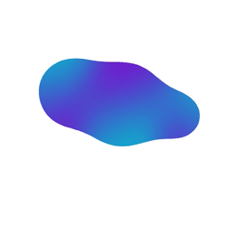

# [](https://npmjs.org/package/ngx-gooey) [](https://stackblitz.com/edit/ngx-gooey)

<p align="center">
  
</p>
<p align="center">
<h1 align="center">The gooey effect for Angular</h1> 
</p>
The 'gooey effect' has been made popular by various (amazing) blogposts over the years. This tiny component makes it easy to use within Angular, and has improved the implementation. It's optimized to be as sharp/crisp as possible, since existing implementations can be a bit blurry. Safari support (which can be notorious, and is usually missing) has been added as well.


## Installation

```sh
npm install ngx-gooey
```

## Usage

**For Angular with Standalone Components (Recommended):**

```typescript
import { Component } from '@angular/core';
import { Gooey } from 'ngx-gooey';

@Component({
  selector: 'app-example',
  standalone: true,
  imports: [Gooey],
  template: `
    <ngx-gooey>
      <svg width="200" height="100">
        <circle cx="50" cy="50" r="20" fill="blue"/>
        <circle cx="100" cy="50" r="20" fill="red"/>
      </svg>
    </ngx-gooey>
  `
})
export class ExampleComponent {}
```

**For NgModule-based applications:**

```typescript
import { BrowserModule } from '@angular/platform-browser';
import { NgModule } from '@angular/core';

import { AppComponent } from './app.component';

// Import the library
import { Gooey } from 'ngx-gooey';

@NgModule({
  declarations: [AppComponent],
  imports: [
    BrowserModule,
    Gooey, // <-- Add this line
  ],
  providers: [],
  bootstrap: [AppComponent],
})
export class AppModule {}
```

Then use it in your template:

```html
<ngx-gooey> … </ngx-gooey>
```

You can put regular HTML elements inside `ngx-gooey`, but using an SVG is recommended for better browser support. Shape blobbing will be applied to everything within the component.

[Visit the website](https://ngx-gooey.netlify.app/) for full documentation, properties and examples.

## Related

inspired by [gooey-react](https://github.com/luukdv/gooey-react)
