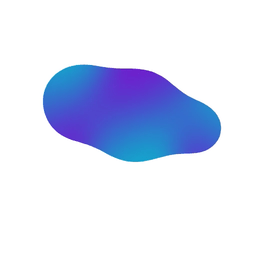

# [](https://npmjs.org/package/ngx-gooey) [](https://stackblitz.com/edit/ngx-gooey)

<p align="center">
  
</p>
<p align="center">
<h1 align="center">The gooey effect for Angular 21+</h1> 
</p>

The 'gooey effect' has been made popular by various (amazing) blogposts over the years. This tiny component makes it easy to use within Angular applications, and has improved the implementation. It's optimized to be as sharp/crisp as possible, since existing implementations can be a bit blurry. Safari support (which can be notorious, and is usually missing) has been added as well.

## 📦 Installation

```bash
npm install ngx-gooey
```

**Requirements:**
- Angular 21+
- TypeScript 5.9+

## 🚀 Usage

**Modern Standalone Components (Angular 14+, Recommended):**

```typescript
import { Component } from '@angular/core';
import { Gooey } from 'ngx-gooey';

@Component({
  selector: 'app-example',
  standalone: true,
  imports: [Gooey],
  template: `
    <ngx-gooey intensity="medium">
      <div class="blob-container">
        <div class="blob"></div>
        <div class="blob"></div>
        <div class="blob"></div>
      </div>
    </ngx-gooey>
  `,
  styles: [`
    .blob-container {
      display: flex;
      gap: 20px;
      padding: 50px;
    }
    .blob {
      width: 60px;
      height: 60px;
      background: #ff6b6b;
      border-radius: 50%;
    }
  `]
})
export class ExampleComponent {}
```

**Legacy NgModule-based Applications:**

```typescript
import { BrowserModule } from '@angular/platform-browser';
import { NgModule } from '@angular/core';
import { AppComponent } from './app.component';
import { Gooey } from 'ngx-gooey';

@NgModule({
  declarations: [AppComponent],
  imports: [
    BrowserModule,
    Gooey, // Add the Gooey component
  ],
  providers: [],
  bootstrap: [AppComponent],
})
export class AppModule {}
```

**In your component template:**

```html
<ngx-gooey 
  intensity="strong" 
  [composite]="true"
  className="my-gooey-effect">
  <!-- Your content here -->
  <div class="animated-elements">
    <div class="circle"></div>
    <div class="circle"></div>
  </div>
</ngx-gooey>
```

## 🎛️ Component Properties

| Property | Type | Default | Description |
|----------|------|---------|-------------|
| `intensity` | `'weak' \| 'medium' \| 'strong'` | `'medium'` | Controls the strength of the gooey effect |
| `composite` | `boolean` | `false` | Enables composite blending for enhanced effects |
| `className` | `string` | `undefined` | CSS class to apply to the wrapper element |
| `id` | `string` | `'gooey-angular'` | Unique ID for the SVG filter |
| `style` | `object` | `undefined` | Inline styles to apply to the wrapper |

## 💡 Tips & Best Practices

- **Use SVG for best results**: While HTML elements work, SVG provides the most consistent cross-browser support
- **Optimize performance**: The gooey effect uses CSS filters, so avoid using too many instances on one page
- **Safari compatibility**: This implementation includes optimizations for Safari, which often has issues with gooey effects

## 🔄 Version Compatibility

| ngx-gooey Version | Angular Version
|-------------------|-----------------|-------------------|
| 21.x.x | Angular 21+
| 20.x.x | Angular 20
| 19.x.x | Angular 19

## 📚 Documentation & Examples

[Visit the website](https://ngx-gooey.netlify.app/) for:
- 🎨 Interactive examples
- 📖 Complete API documentation  
- 🎯 Advanced usage patterns
- 🔧 Configuration options

## 🤝 Contributing

Contributions are welcome! Please feel free to submit a Pull Request.

## 📄 License

MIT License - see the [LICENSE](LICENSE) file for details.

## 🙏 Related

Inspired by [gooey-react](https://github.com/luukdv/gooey-react)
